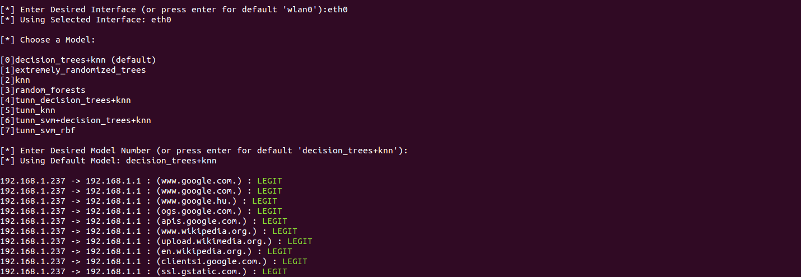

<p align="center">
  
</p>

# DetExt
> Detection of malicious data exfiltration and tunnelling over DNS using Machine Learning techniques

The DNS protocol can be used to exfiltrate data or create a tunnelled connection as a part of an individual cyberattack or in the process of an Advanced Persistent Thread. By analysing the DNS logs of the networking devices these attacks can be detected and stopped before a bigger harm is done to the objective of the attack. These logs can have thousands of lines in a small network, therefore, in big company networks the data to handle can be huge. For this reason, this project pretends to create an effective way to detect these attacks by using Machine Learning to analyse the data contained in the logs.

This project focuses in the data exfiltration part, although the detection of tunnels using the DNS protocol is also investigated.

## Getting started

The project contains:

- A series of Jupyter notebooks where DNS data containing legitimate queries and attacks is analysed and different techniques of Machine Learning are discussed to address the problem. These notebooks can be viewed directly on GitHub or they can be downloaded and run locally. (Currently in Spanish)

- Several Artificial Intelligence models created as a result of the data analysis. Various models are created using different feature vectors.

- A live monitoring tool that sniffs the DNS packets for a given network interface and uses the AI models to classify the queries in legitimate or attacks.

Note that this project is a prototype: the data used to train the models is not real data, due to the difficulties to obtain big amounts of real DNS data while controlling the whole process. The DNS queries used have been generated with a Python program that creates random queries to a list of popular domains and subdomains.

As a result of this, the performance of the AI models and the live monitoring tool might not be the best. However, after testing it with the best models that use the "entropy and ratios" feature vector, the results are quite good. So, even if the models were not trained using real DNS queries, the performance (precision and recall) in a real scenario is acceptable.

The models using the "entropy and ratios" feature vector have been proved to perform better than the ones using the other feature vectors, consequently these are the ones used in the live sniffer. Some models have been trained only with DNS exfiltration data and other models have been trained with DNS exfiltration and DNS tunnelling data. The latter have the prefix "tunn" in their file name. Both of them have a similar performance.

In order to generate the attacks, the following applications have been used:

- DNS Data Exfiltration: [DET (Data Exfiltration Toolkit)](https://github.com/PaulSec/DET) is used with the DNS protocol option.

- DNS Tunnelling: [iodine](https://github.com/yarrick/iodine) is used to generate an IPv4 tunnel through the DNS protocol. The DNS request type is forced to use a type A.

The models have only been trained and tested with data generated by these two tools, so the behaviour is unknown with other exfiltration or tunnelling software. However, if they use a similar approach, the solution created here may also have a good performance. Otherwise, it would be an easy task to train the models with data generated by other types of software.

### Installation and setup

1. Clone or download repository.
2. Create a virtual environment with Python 3 (the version 3.6.5 has been used for development).
```shell
$ python3 -m venv venv
```
3. Activate the environment.
```shell
$ source venv/bin/activate
```
4. Install the requirements in requirements.txt.
```shell
$ pip3 install -r ./requirements.txt
```

---

#### Running the monitoring tool

1. Run the live sniffer with superuser privileges.
```shell
$ sudo venv/bin/python3 live_sniffer.py
```
2. A menu will be displayed in the terminal to choose the network interface and the model to analyse the traffic.



---

#### Running the Jupyter notebooks
```shell
$ jupyter notebook
```

### Configuration

The tool used to log the DNS queries for the training data is [BRO](https://github.com/bro). Therefore, the functions <i>create_feature_vector_from_log_file</i> and <i>create_feature_vector_from_log_file_tunnelling</i> in [feature_vector_creation.py](https://github.com/AlejandroGallego/dns-attacks-detection/blob/master/feature_vector_creation.py) expect a log format like the one generated by BRO.

Every line (except for the header and footer) should have this format:

```
ts	uid	id.orig_h	id.orig_p	id.resp_h	id.resp_p	proto	trans_id	rtt	query	qclass	qclass_name	qtype	qtype_name	rcode	rcode_name	AA	TC	RD	RA	Z	answers	TTLs	rejected
```

In order to perform the supervised learning, the way to identify an attack is that they are all directed to a DNS server with the IP "1.1.1.1" (for DNS exfiltration) or that the attacks are directed to the domain "test.com" (for DNS tunnelling).

The function can be changed to parse other types of log files or to identify the attacks with another flags.

### Data analysis

The analysis of the DNS data uses the approach of Payload Analysis, which means that the payload of a single request is analysed in order to extract the features from it. Specifically, only the DNS query is considered, so if there is more data in the DNS message, like in TXT records, this is ignored.

Therefore this tool focuses in the analysis of the subdomain of a DNS query, not considering the rest of the information contained in a DNS request. In the future, a deeper analysis could be implemented using the same techniques.

Given that each query is analysed individually, it makes possible to detect an attack with a single query. Attacks are made of many queries, so by detecting just one of them the whole attack would be identified.
